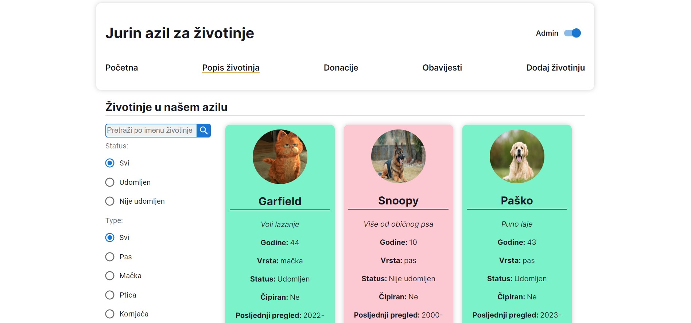
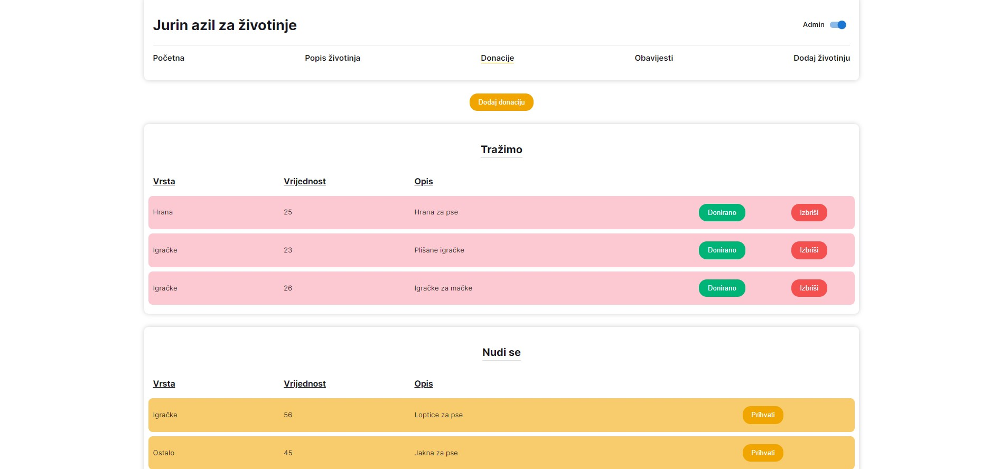
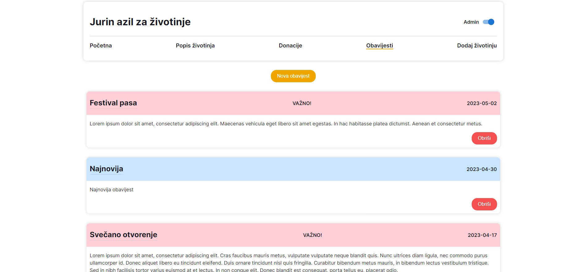

In March 2023 I attended a 2-month long React education at [Digitalna Dalmacija](https://digitalnadalmacija.hr/). For the final project all participants (including me) got a task to create a React app for a fictional animal shelter where users can find information about the shelter itself, about the animals inside inside the shelter and about their adopted status, about the donations that shelter needs or wants to give away, and about all the announcements that shelter wants to share with the public.

There also needed to be an admin role built in, where admin can add new animals, edit existing ones and delete them. Admin can also edit donations and announcements, add new ones or delete the existing ones.

## Table of contents

- [The challenge](#the-challenge)
  - [Screenshot](#screenshot)
  - [Links](#links)
- [Built with](#built-with)
  - [What I learned](#what-i-learned)

### The challenge

All users should be able to:

- View the optimal layout for the app depending on their device's screen size
- See corect layout depending if their role is "admin" or "user"
- See a list of all animals in the shelter
- Filter animals by their status (adopted, not adopted, all), type (dog, cat, turtle, etc,) or name
- See a list of all donations and announcements
- Interact with the app by changing the status of the animal, accepting or rejecting donations, and adding new announcements

### Screenshot

### Links

- Live Site URL: https://jure-reljanovic-animal-shelter.netlify.app/

### Built with

- Firebase
- CSS Modules
- Material UI
- [React](https://reactjs.org/)
- React Router

### What I learned

The whole app wasn't that hard for me to build, since I already had a decent amount of experience with React before even entering the education. But I did learn a lot about Firebase and how to use it with React. I also learned how to use Material UI to save time on styling and how to use React Router to turn single page app into multi page app.
